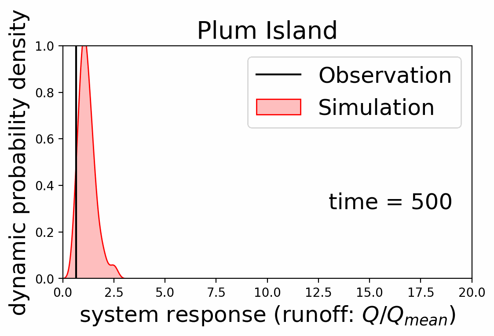

  
  <i>Fig:  In a stochastic dynamical system, the evolution of the system states will get represented by changing probabilities. (It's an ongoing project.)</a></i>

# Overview

* Repository: https://github.com/waniomar/sde
* License: [MIT](https://github.com/waniomar/sde/blob/main/LICENSE)

In this research project, I will explore the benefits and limitations of using a suite of appropriate stochastic
differential equations to model catchment storage . To test the performance of these equations,
I will employ a recently-compiled multivariate hydrologic time series dataset of input and response variables,
taken from 30 different watersheds spread across the Contiguous US. I will infer several catchment-storage
characteristics from the data as part of this analysis. This will hopefully generate new insights on the variation
and similarity of storage across different types of watersheds, and perhaps even on its seasonality. In effect,
this research work is aimed to inform us about both the dynamics of catchment storage and the dynamics of its
parametric and predictive uncertainties.# sde
